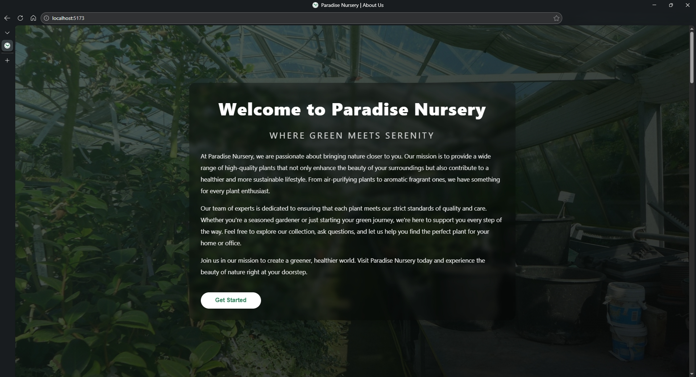
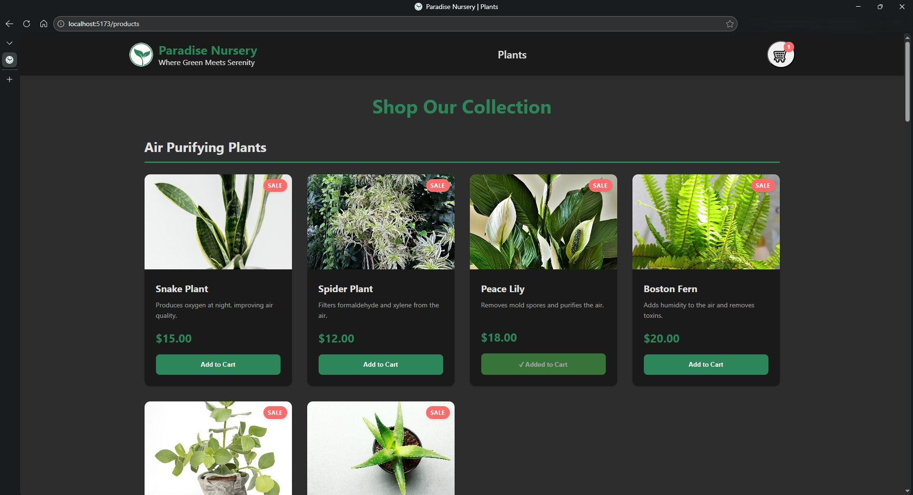
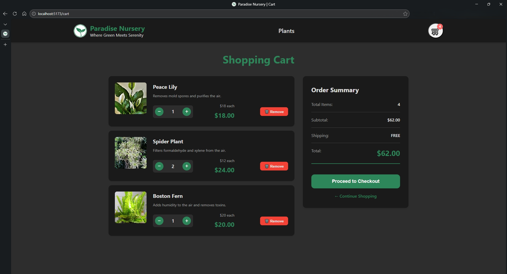

Here’s the updated `README.md` with your requested sections fully included and formatted:

````markdown
# 🌿 Paradise Nursery – React + Vite Shopping App

Paradise Nursery is a single‑page React application where users can browse houseplants, add them to a cart, adjust quantities, and review an order summary before checkout. It’s built with Vite, React Router, and Redux Toolkit.

---

## Table of Contents

- [Features](#features)
- [Tech Stack](#tech-stack)
- [Getting Started](#getting-started)
- [Available Scripts](#available-scripts)
- [Project Structure](#project-structure)
- [Key Implementation Details](#key-implementation-details)

---

## Features

- Landing/About page with full‑screen hero and “Get Started” scroll to products.
- Product listing grouped by category (air purifying, aromatic, low maintenance, decorative).
- Product cards with images, descriptions, prices, **Sale** badge, and Add to Cart button.
- Cart icon in the header with dynamic item count, visible on all pages.
- Shopping cart page with:
  - Per‑item quantity controls (+/−) and delete.
  - Automatic subtotal per item and overall total.
  - Checkout confirmation alert.
- Button state:
  - After adding an item, the product button shows “✓ Added to Cart” and disables.
  - When quantity drops to 0 or item is removed in the cart, the button re‑enables.
- Persistent header navigation:
  - Logo + name → landing/about page.
  - “Plants” nav item → product list page.
  - Cart icon → cart summary page.
- Basic responsive layout for desktop and mobile.

---

## Tech Stack

- **Frontend:** React 18, Vite
- **Routing:** React Router
- **State Management:** Redux Toolkit, React‑Redux
- **Styling:** CSS with design tokens (CSS custom properties)
- **Build Tool:** Vite dev server and bundler

---

## Getting Started

1. **Install dependencies**

   ```bash
   npm install
   ```
````

2. **Start the development server**

   ```bash
   npm run dev
   ```

3. Open the URL shown in the terminal (usually `http://localhost:5173`).

4. **Build for production**

   ```bash
   npm run build
   ```

5. **Preview the production build**

   ```bash
   npm run preview
   ```

---

## Available Scripts

- `npm run dev` – Start Vite dev server with hot reloading.
- `npm run build` – Build the app for production.
- `npm run preview` – Preview the production build locally.
- `npm run lint` – (If configured) Run ESLint on the project.

---

## Project Structure

```text
.
├── public/
│   ├── favicon.ico           # Multi-size favicon for browser tab
│   └── paradise-nursery-logo # Logo asset(s)
├── src/
│   ├── components/
│   │   ├── Header.jsx        # Header with logo, nav, cart icon
│   │   ├── ProductCard.jsx   # Individual plant card
│   │   ├── CartItem.jsx      # Cart line item
│   │   └── CartSummary.jsx   # Order summary sidebar
│   ├── pages/
│   │   ├── LandingPage.jsx   # About + hero + scroll to products
│   │   ├── ProductList.jsx   # Product listing with Add to Cart
│   │   └── ShoppingCart.jsx  # Cart page with quantity controls
│   ├── store/
│   │   ├── cartSlice.js      # Redux slice for cart state
│   │   └── store.js          # Redux store configuration
│   ├── data/
│   │   └── plantsData.js     # Plant catalog grouped by category
│   ├── styles/
│   │   └── index.css         # Global styles and layout
│   ├── App.jsx               # Routes for /, /products, /cart
│   └── main.jsx              # React root, wraps App with Provider
├── screenshots/
│   ├── landing-page.png
│   ├── product-list.png
│   └── shopping-cart.png
├── .gitignore
├── .prettierignore
├── index.html
├── package.json
└── README.md
```

---

## Key Implementation Details

- **Cart logic:** Implemented with a Redux Toolkit slice. Items are stored with `name`, `image`, `description`, `cost` (numeric), and `quantity`. Selectors compute:
  - `selectCartItems`
  - `selectCartTotalItems`
  - `selectCartTotalCost`

- **Price formatting:** If plant prices are strings like `"$13"`, they are normalized with `parseFloat` in `ProductCard` before dispatching to the cart so all calculations use numeric values.

- **Button state sync:** The product list derives `isAdded` from cart contents. When an item exists in the cart, its button shows “✓ Added to Cart” and is disabled; removing or decrementing to zero removes the item from state, which re‑enables the button.

- **Dynamic titles & meta:**
  - Each page sets `document.title` in a `useEffect` to update the browser tab title (e.g., `Paradise Nursery • Cart`).
  - `index.html` includes a meta description such as:

    ```html
    <meta
      name="description"
      content="Paradise Nursery is your online destination for air-purifying, aromatic fragrant, insect repellent, medicinal and low-maintenance houseplants. Browse our curated collection, add plants to your cart, and bring nature into your home." />
    ```

- **Favicon:** A multi‑size `favicon.ico` (16×16, 32×32) generated from the Paradise Nursery logo is placed in `public/` and referenced from `index.html`:

  ```html
  <link rel="icon" href="/favicon.ico" />
  ```

## Screenshots

### Landing / About Page



### Product List



### Shopping Carts


